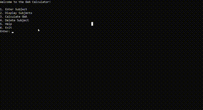

# GWA-Calc: Your Grade Management Tool

## Overview

GWA-Calc is a C++ program designed to help you manage your academic grades more effectively. It offers four key features:

1. **Add Subjects**: Input subject details such as name, units, grading system, and assessment scores (e.g., midterms, prelims, finals, class participation). The program calculates the final grade, converts it to units if applicable, and provides performance remarks.

2. **Display Subjects**: View a table of all added subjects with their units and remarks, offering a quick overview of your academic progress.

3. **Calculate GWA (General Weighted Average)**: Compute your General Weighted Average using the final grades of all subjects to evaluate your overall academic performance.

4. **Delete Subject**: Remove subjects from your record, ensuring your data remains current.

## How to Use

### Setup

1. **Compile the Program**:
   - Ensure a C++ compiler is installed on your system.
   - Download the `GradeCalculator.cpp` source file.
   - Compile using:
     ```
     g++ main.cpp -o main.exe
     ```

2. **Run the Program**:
   - Execute the compiled file:
     ```
     ./main.exe
     ```

3. **Follow Prompts**: Use the on-screen instructions to navigate the program's features.

### Example



**Note**: This tool is designed for easy management and tracking of academic grades. Customize it as needed to better suit your requirements.

**Enjoy managing your grades with GWA-Calc!**